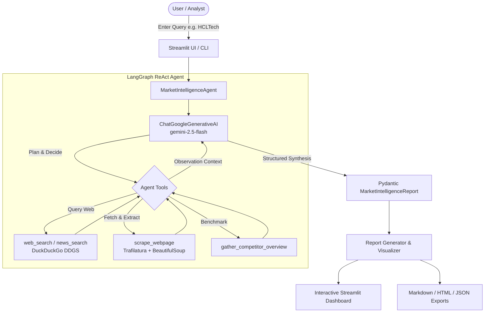

# ⚡ Agentic Web Scraper & Market Intelligence Report

An autonomous, multi-stage **Market Intelligence & Competitor Analysis Agent** built with **LangChain**, **LangGraph**, and **Google Gemini**, integrated with real-time web search and page content scraping.

---

## 🌟 Key Features

- **Autonomous Agentic Research Loop**: Built with LangChain & LangGraph ReAct agent architecture that autonomously plans search queries, analyzes multi-source web results, and explores target companies and competitors.
- **Deep Web Scraping Engine**: Zero-API-key web and news search via DuckDuckGo (`ddgs`), coupled with deep article and table extraction via `trafilatura` and `beautifulsoup4`.
- **Structured Pydantic Intelligence Schema**: Guaranteed valid, type-safe reports covering:
  - 📊 **Executive Summary** & Strategic Positioning
  - 💰 **Key Financial & Operational Metrics** (Revenue, Margins, Headcount)
  - 🧭 **SWOT Strategic Analysis Quadrant**
  - ⚔️ **Competitor Capability Benchmarking** (AI readiness, Cloud capability, Global scale)
  - 🌐 **Market Drivers & Technology Trends**
  - ⚠️ **Strategic Risks & Mitigation Framework**
  - 🎯 **Actionable Executive Recommendations**
  - 🔗 **Verified Sources & Web Citations**
- **Modern Executive Dark Dashboard**: Built with Streamlit featuring glassmorphism design, real-time agent execution traces, interactive Plotly benchmarking & radar charts, and instant demo loading.
- **💬 Interactive Post-Analysis Copilot (Chatbot)**: Dedicated conversational AI assistant grounded directly in the synthesized intelligence report. Supports real-time streaming Q&A, suggested strategy prompt chips (e.g., 30-60-90 day execution roadmaps, competitor AI deep-dives, scenario simulations), and Markdown transcript export.
- **Multi-Format Export Center**: One-click download as **Markdown (.md)**, **Standalone HTML (.html)**, or **JSON Schema (.json)**.
- **CLI Mode**: Headless command-line tool for scheduling or automated batch reporting.


---

## 🏗️ System Architecture



---

## 🚀 Quick Start

### 1. Prerequisites & Environment Setup

Ensure Python 3.10+ is installed. Activate your virtual environment and install the dependencies:

```bash
# Activate existing virtualenv
.venv\Scripts\activate

# Install requirements
pip install -r requirements.txt
```

### 2. Configure Google Gemini API Key

Obtain your free Gemini API Key from [Google AI Studio](https://aistudio.google.com/).

You can set it in a `.env` file or export it:

```bash
# Copy template
cp .env.example .env

# Edit .env and insert your API key:
GOOGLE_API_KEY=AIzaSy...
```

*(You can also enter your API key directly in the Streamlit web dashboard sidebar!)*

---

## 🖥️ Running the Web Dashboard

Launch the interactive dashboard with:

```bash
.venv\Scripts\streamlit run app.py
```

Open `http://localhost:8501` in your browser.

1. Enter your Gemini API key in the sidebar (if not already set in `.env`).
2. Select your target subject (e.g. `HCL Technologies`, or select one of the built-in presets).
3. Click **🚀 Launch Autonomous Intelligence Agent**.
4. Watch the agent live-stream its thoughts, search queries, and scraped evidence.
5. Explore the interactive tabs (Executive Briefing, Competitor Radar & Bar Charts, SWOT Matrix, Trends, Sources) and export your report.

---

## 💻 Running via Command-Line Interface (CLI)

Generate headless intelligence reports automatically:

```bash
# Analyze HCL Technologies
.venv\Scripts\python cli.py --target "HCL Technologies" --focus "Cloud transformation, AI Force, FY25 outlook"

# Analyze competitor comparison
.venv\Scripts\python cli.py --target "HCLTech vs TCS vs Infosys" --format all -o reports/
```

Reports will be generated in `reports/` in `.md`, `.html`, and `.json` formats.

---

## 📁 Repository Structure

```
hcl-marketanalyzer/
├── market_analyzer/
│   ├── scraper/
│   │   ├── searcher.py       # DuckDuckGo search (web & news)
│   │   └── extractor.py      # Trafilatura + BeautifulSoup HTML parser
│   ├── agent/
│   │   ├── tools.py          # LangChain tools for searching & scraping
│   │   ├── schemas.py        # Pydantic structured intelligence report schema
│   │   ├── prompts.py        # System instructions & prompts
│   │   └── intelligence_agent.py # LangGraph ReAct agent & structured synthesizer
│   └── reporting/
│       ├── report_generator.py # Formats reports into Markdown, HTML, JSON
│       └── visualizer.py     # Plotly competitor capability & radar charts
├── app.py                    # Streamlit web dashboard
├── cli.py                    # CLI report generator
├── requirements.txt          # Python dependencies
├── .env.example              # Environment variables template
└── README.md                 # Project documentation
```

---

## 🛡️ License

MIT License. Built with LangChain, LangGraph, and Google Gemini.
