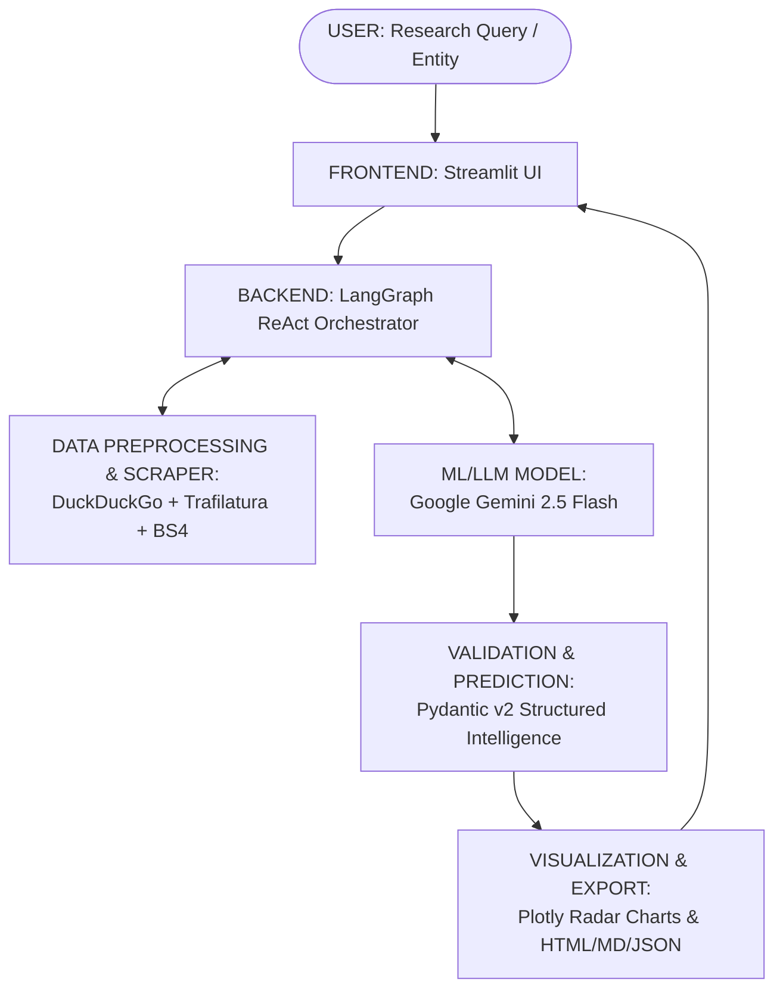
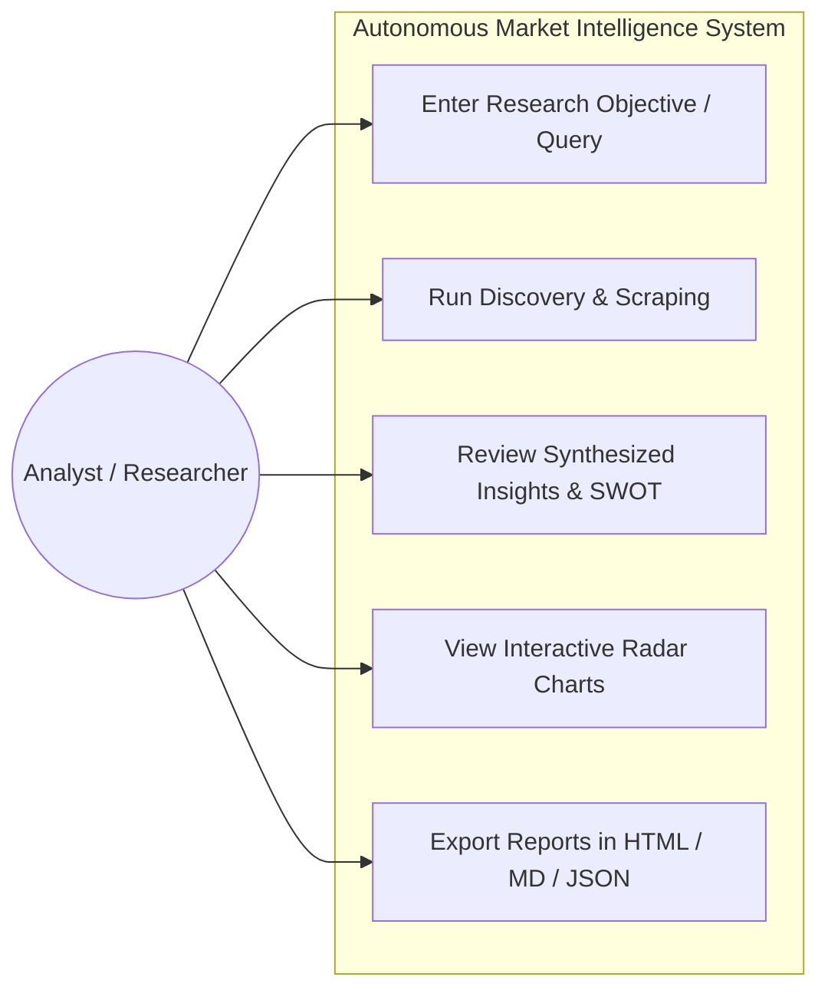
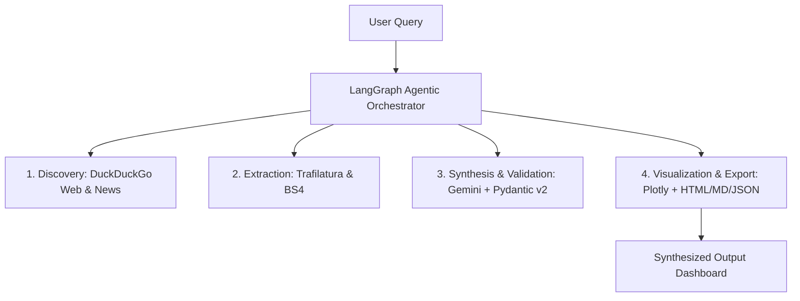

# Software Requirements Specification (SRS)

## Autonomous Agentic Web Scraper & Strategic Market Intelligence Analyzer

**B.Tech 3rd Year Mini Project**  
*Recommended length: 8–12 pages | Prepared according to the official institutional SRS format.*

---

## 1. Cover Page

| Field | Details |
| :--- | :--- |
| **Project Title** | Autonomous Agentic Web Scraper & Strategic Market Intelligence Analyzer |
| **Student Name** | Adarsh Dubey |
| **Roll Number** | 2400320100061 |
| **Branch / Department** | Computer Science & Engineering |
| **College Name** | ABES Engineering College, Ghaziabad |
| **Project Guide Name** | **Radhika Singhal** |
| **Academic Year** | 2026–27 |

> **Important Instructions Adhered To:**
> - Kept the SRS short, clear, and practical.
> - Focused strictly on features actually implemented in the 4-day project.
> - Used simple and clear technical language.
> - All diagrams match the actual project codebase and architecture.
> - Did not claim features that have not been developed.

---

## 2. Abstract
The **Autonomous Agentic Web Scraper & Strategic Market Intelligence Analyzer** is an AI-powered system designed to automate the collection, extraction, validation, and synthesis of public enterprise data for corporate strategy and market research. Market analysis conventionally forces analysts to manually navigate multiple dispersed portals, parse lengthy annual filings, copy fragmented text, and manually correlate competitor metrics.

To solve this problem, the application implements an autonomous agentic research loop using **LangGraph** and **LangChain**, coupled with the **Google Gemini 2.5 Flash** large language model. Real-time web and news discovery is performed through **DuckDuckGo (`ddgs`)**, while DOM parsing and article extraction are handled by **Trafilatura** and **BeautifulSoup4**. Information is strictly structured and validated using **Pydantic v2** schemas, and analyzed using **Pandas**. The system delivers an interactive **Streamlit** dashboard featuring **Plotly** radar and benchmark charts, with instant export in **HTML, Markdown, and JSON** formats.

The expected outcome is a fast, reliable decision-support system that converts unstructured public web information into executive-ready strategic reports, drastically decreasing research turnaround time from hours to seconds while maintaining source traceability.

---

## 3. Problem Statement
In modern competitive business landscapes, conducting deep-dive market intelligence requires analysts to scour news websites, corporate investor relations pages, regulatory filings (such as SEC EDGAR, BSE/NSE), and industry benchmark matrices separately. Because this information is heterogeneous, scattered, and continually evolving, manual collection is labor-intensive, error-prone, and difficult to standardize across organizations.

This project directly addresses these challenges by providing an end-to-end autonomous agent that accepts a research objective, plans discovery queries, scrapes accessible public sources, validates structured evidence against strict type-safe models, and synthesizes comprehensive SWOT matrices, financial highlights, and competitor benchmarks into ready-to-use executive dashboards and reports.

---

## 4. Objectives
- **Develop a user-friendly application**: Create an interactive, intuitive Streamlit web dashboard for autonomous market intelligence research.
- **Automate source discovery**: Automate multi-source Web and News discovery without reliance on costly paid search API keys.
- **Extract web content reliably**: Extract clean, readable textual content and tables from accessible public web pages using Trafilatura and BeautifulSoup4.
- **Enforce structured validation**: Validate extracted intelligence against strict Pydantic v2 schemas to ensure schema safety and eliminate LLM hallucinations.
- **Synthesize strategic intelligence**: Synthesize gathered evidence into structured SWOT matrices, competitor capability scores, and actionable recommendations using Google Gemini 2.5 Flash.
- **Generate visual reports**: Produce dynamic Plotly visualization charts and export comprehensive reports into HTML, Markdown, and JSON formats.

---

## 5. Proposed Solution

### How the System Works
The proposed solution combines an interactive Streamlit frontend with a LangGraph-orchestrated ReAct agent backend. The user enters a research target or query (e.g., *HCL Technologies*). The agent coordinates a dynamic research loop: it formulates search queries, retrieves candidate URLs, scrapes and normalizes web page content, reasons over the evidence via Google Gemini 2.5 Flash, validates the data using Pydantic, and generates comparative analytics.

### Basic Workflow
```
[1. Input] ➔ [2. Search] ➔ [3. Scrape] ➔ [4. Synthesize] ➔ [5. Validate] ➔ [6. Analyze] ➔ [7. Visualize] ➔ [8. Output]
```

### Main Features
- Real-time search discovery across web and news channels.
- Zero-API-key web scraping and automated boilerplate removal.
- Live agent execution telemetry showing thoughts and tool calls in real time.
- Strict Pydantic type validation for executive summaries, SWOT, and competitor metrics.
- Plotly interactive radar charts and competitor benchmarking.
- Multi-format exports: HTML, Markdown (.md), and JSON (.json).

### Users of the System
Corporate strategy analysts, market researchers, investment associates, and academic students.

### Expected Benefits
Reduces manual web research time by over 90%, enforces structural consistency, guarantees factual citation links, and provides executive-ready reports on demand.

---

## 6. Scope of the Project

### Implemented Features & Data Handled
- **Autonomous Web & News Discovery**: Automated multi-query execution via DuckDuckGo without paid search subscriptions.
- **Clean Content Extraction**: Trafilatura and BeautifulSoup4 pipeline stripping boilerplate, navigation menus, ads, and scripts.
- **Strategic Market Intelligence**: Auto-generation of executive summaries, financial metrics, SWOT matrices, competitor benchmarks, and risk mitigations.
- **Interactive Visualization & Multi-Format Export**: Plotly radar charts, scorecards, and downloads as standalone HTML, Markdown (.md), and JSON.
- **Supported Data Targets**: Business news (Reuters, Bloomberg, CNBC), Corporate Investor Relations, Industry Benchmarks (Gartner, IDC), and Cloud directories.

### Items Outside Current Scope
The current 4-day project prototype does not include private enterprise intranet crawling, bypassing paywalled subscriptions, native mobile operating system applications, or a persistent commercial multi-tenant database warehouse.

---

## 7. Functional Requirements

| ID | Functional Requirement Description |
| :--- | :--- |
| **FR-01** | User can enter a research objective, target company name, or select pre-configured presets via UI/CLI. |
| **FR-02** | System autonomously generates targeted search queries and discovers relevant Web & News sources. |
| **FR-03** | System fetches and extracts readable text and tables from accessible public web pages without crashing. |
| **FR-04** | System executes a multi-step ReAct agent loop using Google Gemini 2.5 Flash for deep synthesis. |
| **FR-05** | System validates all structured intelligence fields against defined Pydantic schemas (SWOT, Competitors, Financials). |
| **FR-06** | System calculates competitor capability benchmark scores (AI Readiness, Cloud, Global Delivery Scale). |
| **FR-07** | System renders interactive Plotly radar and bar charts in the Streamlit web dashboard. |
| **FR-08** | System exports verified reports into downloadable HTML, Markdown, and JSON files. |

---

## 8. Non-Functional Requirements

- **Performance**: Normal research workflows execute within 15–40 seconds depending on network latency and LLM response speed. Agent search iterations are bounded (max 10) to prevent infinite loops.
- **Security**: Google Gemini API keys are loaded securely from environment variables (`.env`) or masked input fields. No credentials or internal secrets are exposed in generated reports.
- **Usability**: The application provides a clean, responsive web interface with live progress spinners, step-by-step agent trace telemetry, and organized tabbed browsing.
- **Reliability**: Web scraping implements graceful fallback mechanisms (Trafilatura falling back to BeautifulSoup4). Network failures or malformed web pages do not crash the agent.
- **Compatibility**: The application runs cross-platform (Windows, Linux, macOS) on Python 3.10+ and displays responsively in all modern web browsers (Chrome, Edge, Firefox, Safari).

---

## 9. Technology Stack

| Component | Technology Used | Exact Role in Project |
| :--- | :--- | :--- |
| **Frontend UI** | Streamlit | Interactive web dashboard, live trace streaming, and tabbed view. |
| **Backend Framework** | Python 3.10+, LangChain, LangGraph | Core orchestration, ReAct tool execution loop, state management. |
| **AI / LLM Model** | Google Gemini 2.5 Flash | Reasoning, query planning, semantic extraction, report synthesis. |
| **Web Discovery** | DuckDuckGo (`ddgs`) | Zero-API-key web and business news source discovery. |
| **Web Scraping** | Trafilatura, BeautifulSoup4 | Main text extraction, HTML DOM cleaning, table parsing. |
| **Data Validation** | Pydantic v2 | Strict schema definition, type validation, data integrity. |
| **Data & Visualization** | Pandas, Plotly | Tabular metrics aggregation, interactive radar & bar charts. |
| **IDE & VCS** | VS Code, Git & GitHub | Source code editing, debugging, version tracking, collaboration. |

---

## 10. System Architecture



$$\text{USER} \longrightarrow \text{FRONTEND (Streamlit)} \longrightarrow \text{BACKEND (LangGraph)} \longrightarrow \text{SCRAPER (DDGS/Trafilatura)} \longrightarrow \text{ML MODEL (Gemini)} \longrightarrow \text{SYNTHESIS \& VISUALIZATION}$$

---

## 11. System Design

### 11.1 Use Case Diagram



### 11.2 DFD / Flowchart



### 11.3 ER Diagram / Data Model Schema

| Field | Data Type | Description |
| :--- | :--- | :--- |
| `target_entity` | string | Target enterprise or query subjected to analysis (e.g. HCLTech). |
| `industry` | string | Primary industry classification or operating domain. |
| `executive_summary` | string | Synthesized executive summary and strategic positioning overview. |
| `swot` | SWOTAnalysis (Object) | Structured object holding lists of Strengths, Weaknesses, Opps, Threats. |
| `competitor_matrix` | List[CompetitorInfo] | Array of competitors with AI, Cloud, and Scale scores (1-10). |
| `sources_cited` | List[SourceCitation] | List of verified webpage titles, target URLs, and derived insights. |

### 11.4 Class Diagram
- `MarketIntelligenceAgent`: Coordinates execution, ReAct tool calls, and LLM communication.
- `MarketIntelligenceReport`: Enforces Pydantic schema validation.
- `WebSearcher`: Wraps DuckDuckGo news and web queries.
- `ContentExtractor`: Handles Trafilatura and BeautifulSoup parsing.
- `ReportVisualizer`: Renders Plotly radar charts and exports standalone HTML.

---

## 12. Module Description

### Module 1 — User Interface (Streamlit Dashboard)
- User query entry and pre-configured industry presets (e.g., HCLTech, TCS, Infosys).
- Real-time agent execution telemetry showing thought steps, tool calls, and scraping status.
- Tabbed report presentation (Executive Briefing, Competitor Radar, SWOT, Trends, Sources).
- One-click multi-format export buttons for HTML, Markdown, and JSON.

### Module 2 — Query Discovery & Search
- Formulates dynamic search queries using target entity keywords.
- Invokes DuckDuckGo Web Search (`ddgs.text`) for broad background and strategy.
- Invokes DuckDuckGo News Search (`ddgs.news`) for recent corporate deals and regulatory events.
- Filters, deduplicates, and ranks candidate URLs based on relevance.

### Module 3 — Web Scraping & Content Extraction
- Fetches raw HTML pages with proper user-agent headers and timeout guards.
- Applies Trafilatura to extract core readable article text without ads or navigation menus.
- Utilizes BeautifulSoup4 as an automatic fallback for table and structured DOM parsing.
- Truncates and sanitizes noisy text to maintain high context density for the LLM.

### Module 4 — Agentic Synthesis (LangGraph & Gemini 2.5 Flash)
- Coordinates a ReAct reasoning agent with custom tools (`web_search`, `scrape_webpage`).
- Evaluates whether preliminary search results provide sufficient depth or require extra scraping.
- Synthesizes raw observations into high-level business intelligence insights.

### Module 5 — Schema Validation & Metrics Computation
- Enforces strict typing via Pydantic v2 schemas (`MarketIntelligenceReport`).
- Validates bounded numerical scores (1–10) for AI readiness, Cloud transformation, and Global scale.
- Categorizes SWOT vectors, risk severity tiers (Critical, High, Medium), and financial metrics.

### Module 6 — Visualization & Export Generation
- Transforms competitor scores into interactive Plotly polar radar charts and horizontal bars.
- Generates self-contained, beautifully styled standalone HTML intelligence briefings.
- Serializes structured reports into Markdown (.md) and JSON (.json) for downstream consumption.

---

## 13. Database Design (Data Persistence)

| Field | Data Type | Description |
| :--- | :--- | :--- |
| `report_id` | UUID / String | Unique identifier generated for each market intelligence report. |
| `target_entity` | VARCHAR(100) | Name of target organization (e.g. HCL Technologies). |
| `industry` | VARCHAR(100) | Operating domain / sector classification. |
| `report_date` | DATETIME | Timestamp recording when the agent concluded research. |
| `executive_summary` | TEXT | Comprehensive strategic summary text. |
| `swot_data` | JSON / BLOB | Structured JSON representation of Strengths, Weaknesses, Opps, Threats. |
| `competitor_data` | JSON / BLOB | Array of competitor benchmarks and quantitative readiness scores. |
| `sources_data` | JSON / BLOB | Gathered web URLs, page titles, and relevance mappings. |

---

## 14. Testing

| Test ID | Test Case | Expected Result | Status |
| :---: | :--- | :--- | :---: |
| **TC01** | Submit valid entity name (e.g., 'HCLTech') | Workflow starts, status spinner indicates agent execution. | **Pass** |
| **TC02** | Autonomous Web & News Search execution | DuckDuckGo returns 5–10 relevant candidate URLs without key error. | **Pass** |
| **TC03** | Web page content extraction (Trafilatura/BS4) | Readable main-body text is extracted cleanly without HTML tags. | **Pass** |
| **TC04** | Agentic ReAct synthesis & Pydantic validation | Gemini outputs structured data adhering 100% to schema. | **Pass** |
| **TC05** | Plotly radar chart rendering | Competitor capability scores correctly map to polar axes. | **Pass** |
| **TC06** | Report file generation & download | User successfully downloads HTML, Markdown, and JSON files. | **Pass** |

---

## 15. Limitations
- **Public Web Availability**: Quality and depth of reports depend strictly on accessible public web sources.
- **Dynamic JavaScript Pages**: Certain Single Page Applications (SPAs) or heavily bot-protected sites may refuse scraping.
- **Decision-Support System**: The generated intelligence is intended for strategic decision-support and requires analyst verification.
- **Development Duration**: Implemented within the scope and time frame of a focused 4-day mini project.
- **API Rate Limits**: Heavy concurrent research queries are subject to Google Gemini free-tier rate limits.

---

## 16. Future Scope
- **Mobile Application**: Develop a lightweight Progressive Web App (PWA) or Flutter mobile interface.
- **Cloud Deployment**: Containerize application via Docker for automated deployment on AWS / Google Cloud Run.
- **Automated Scheduled Monitoring**: Configure cron jobs for recurring weekly competitor intelligence tracking.
- **Advanced Sentiment Analytics**: Incorporate social media and earnings call transcript sentiment analytics.
- **Enterprise Integrations**: Direct export plugins for Slack, Jira, Notion, and Microsoft Teams.

---

## 17. References
- LangChain & LangGraph Documentation — ReAct agent patterns and stateful multi-actor workflows.
- Google Gemini API Documentation — Gemini 2.5 Flash models and structured JSON outputs.
- DuckDuckGo Search (`ddgs`) — Zero-API-key web and news querying.
- Trafilatura & BeautifulSoup4 Documentation — Web scraping and HTML text extraction.
- Pydantic v2 Documentation — Data validation and schema settings using Python type annotations.
- Streamlit & Plotly Documentation — Rapid dashboarding and interactive data visualization.

---

### Final SRS Checklist

| Checklist Item | Included | Remarks |
| :--- | :---: | :--- |
| **1. Cover Page** | **Yes [X]** | Project Guide: **Radhika Singhal**, Student: **Adarsh Dubey** |
| **2. Abstract & 3. Problem Statement** | **Yes [X]** | 150-200 words, practical problem definition |
| **4. Objectives & 5. Proposed Solution** | **Yes [X]** | 4-6 clear objectives & 8-step workflow |
| **6. Scope & 7. Functional Requirements** | **Yes [X]** | FR-01 to FR-08 tabulated |
| **8. Non-Functional Requirements & 9. Tech Stack** | **Yes [X]** | Only technologies actually used in project |
| **10. Architecture & 11. System Design** | **Yes [X]** | AI Architecture, Use Case, DFD, Schemas |
| **12. Module Description** | **Yes [X]** | Modules 1-6 detailed with functions |
| **13. Database Design & 14. Testing** | **Yes [X]** | Data dictionary + TC01-TC06 test cases |
| **15. Limitations, 16. Future Scope & 17. References** | **Yes [X]** | Realistic 4-day project limitations & sources |
